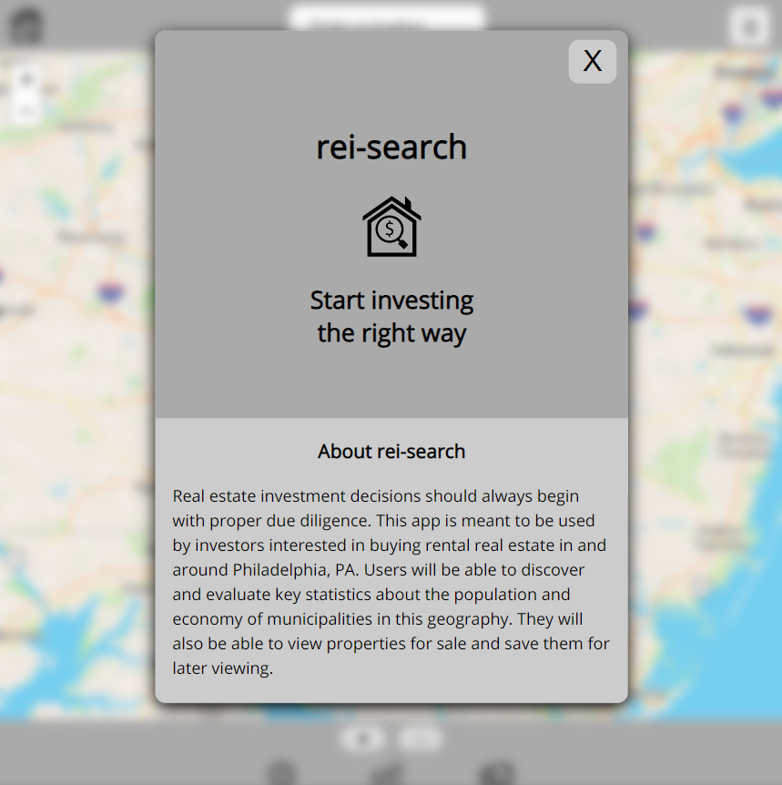

# rei-search-v2

## About rei-search-v2

Real estate investment decisions should always begin with proper due
diligence. This app is meant to be used by investors interested in
buying rental real estate in and around Philadelphia, PA. Users will
be able to discover and evaluate key statistics about the population
and economy of municipalities in this geography. They will also be
able to view properties for sale and catalogue them for later
viewing.

### Get marketplace statistics
The app produces statistical data on three geographic levels:

* **Philadelphia-Camden-Wilmington, PA-NJ-DE-MD Metropolitan
Statistical Area:** MSAs are large geographic regions centered around areas of high
population density (i.e., big cities) with integrated economies.

* **County:** moderately-sized geographies
that provide context for the more granular census tract data.

* **Census Tracts:** small geographic units
used for statistical purposes by the US Census Bureau. CT data may
provide investors with valuable insights into the desirability of a neighborhood.

### Find your next rental property
Each search will produce a list of properties for sale within ten kilometers of a location. You have the option to save properties for later viewing.

## Live app
- [rei-search-v2](http://rei-search-v2-client.vercel.app/)

## Screenshots
### Landing screen

### Responsive mobile-first design
|Mobile stats | Mobile properties |
| --- | --- |
| |  |

### Learn more about individual properties 

### Save properties for later viewing

## Technologies used

- HTML
- CSS
- JavaScript
- React 
- React Router
- React Leaflet 
- Jest 
- React Testing Library
- Node.js 
- Express 
- Knex.js 
- PostgreSQL
- JWT
- Bcrypt
- Mocha 
- Chai
- Sinon 
- LeafletJS 
- MapBox API 
- Vercel 
- Heroku 
- NPM 
- Git 
- GitHub

## How to run
- Clone the repository
- Run `npm install` in the project directory to install the dependencies
- Clone and setup [the API](https://github.com/bradrivenburgh/rei-search-v2-server)
- Create an `.env` file and insert the following environmental variables.  These will also need \
need to be configured on your deployed client (e.g., on Vercel):
- REACT_APP_REISEARCH_API_TOKEN (use the same value you used for your API)
- REACT_APP REISEARCH_API_ENDPOINT (the url of where you are hosting your API (e.g., Heroku))
- REACT_APP_MAPBOX_API_KEY (create a different Mapbox API key that you used in your API)

## Available Scripts

In the project directory, you can run:

### `npm start`

Runs the app in the development mode.\
Open [http://localhost:3000](http://localhost:3000) to view it in the browser.

### `npm test`

Launches the test runner in the interactive watch mode.\

### `npm run build`

Builds the app for production to the `build` folder.